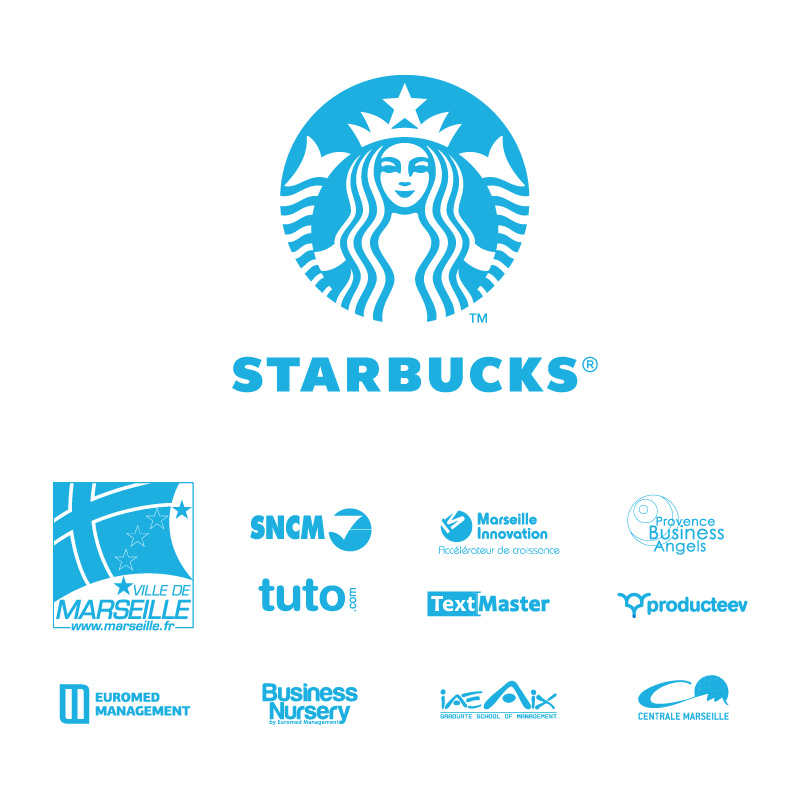

<!SLIDE bullets>

 

# Apéro
* La Boate, Marseille, le 17 novembre 2012

<!SLIDE bullets transition=scrollUp>

# Le Startup Weekend
* Qu'est-ce que c'est ?

<!SLIDE bullets transition=scrollUp>

* Un moyen pour tester une idée
* Et lui donner vie en 54 h

<!SLIDE bullets transition=scrollUp>

# Mais aussi

<!SLIDE bullets transition=scrollUp>

* Faire se rencontrer les entrepreneurs 
* Initier le partage de compétences

<!SLIDE bullets transition=scrollUp>

# Et vous n'êtes pas seuls

<!SLIDE bullets transition=scrollUp>

* Des speakers pour vous inspirer
* Des coaches pour vous conseiller
* Une belle visibilité

<!SLIDE bullets transition=scrollUp>

# Qui peut venir ?

<!SLIDE bullets transition=scrollUp>

* Une idée mais pas les moyens techniques ?
* Designer / créatif inspiré en mal d'aventure ?
* Technicien, envie de tenter quelque chose de nouveau ?
* Simple curieux ?
*   
* Soyez les bienvenus ! 

<!SLIDE bullets transition=scrollUp>

# Des startups issues du SW
* Et qui ont fait leurs preuves !

<!SLIDE bullets transition=scrollUp>

# [Jimmy Fairly](http://www.jimmyfairly.com/)

<!SLIDE bullets transition=scrollUp>

* Gagnant du SW Toulouse #01 (2011)
* Lunettes design et éthiques au prix unique de 95 €
* [Buy one, Give one](http://www.jimmyfairly.com/fr/buy-one-give-one.html)

<!SLIDE bullets transition=scrollUp>

# [Very Last Room](http://verylastroom.com/fr)

<!SLIDE bullets transition=scrollUp>

* Gagnant du SW Marseille #01 (2010)
* Application mobile 
* Trouver une chambre d'hôtel à la dernière minute
* Au meilleur prix

<!SLIDE bullets transition=scrollUp>

# Nos partenaires

<!SLIDE full-page transition=scrollUp>

<!SLIDE bullets transition=scrollUp>

# Des beaux cadeaux

<!SLIDE bullets transition=scrollUp>

* Voyages [SNCM](http://www.sncm.fr/sw/consumer.index.do?locale=fr_FR&languageCode=FRA)
* Journées de conseil [Ernst & Young](http://www.ey.com/FR/fr/Home/Article)
* Hébergement à [La Boate](http://laboate.com/)
* Crédits [TextMaster](http://fr.textmaster.com/)
* Crédits [Tuto.com](http://fr.tuto.com/)
* Codes réduc [Diateino](http://www.diateino.com/fr/)
* Espace de coworking et accompagnement 
* [Marseille Innovation](http://www.marseille-innov.org/)

<!SLIDE bullets transition=scrollUp>

# Prochains rendez-vous

<!SLIDE bullets transition=scrollUp>

* Le 27 novembre à 18h, Angels Café
* au siège de la [Société Marseillaise de Crédit](https://maps.google.fr/maps?hl=fr&q=8+angels+caf%C3%A9+marseille&bav=on.2,or.r_gc.r_pw.r_cp.r_qf.&bpcl=38625945&biw=1268&bih=747&um=1&ie=UTF-8&sa=N&tab=wl&authuser=0)
*   
* Le 29 novembre, soirée de prélancement et expo design
* à [Marseille Innovation](http://www.marseille-innov.org/)
*   
* Et le 30 novembre à [Euromed Management](http://www.euromed-management.com/) pour…

<!SLIDE bullets transition=scrollUp>

<iframe width="1200" height="900" src="http://www.youtube.com/embed/t-VjwfaRRqg" frameborder="0" allowfullscreen></iframe>

<!SLIDE bullets transition=scrollUp>

# Inscription
* [swma4.eventbrite.com](http://swma4.eventbrite.com/)
* Code réduc
* Voir pour mettre 10 codes promos @antoine

<!SLIDE bullets transition=scrollUp>

# Merci pour votre attention
* Site [marseille.startupweekend.org](http://marseille.startupweekend.org)
* Twitter [@SWMarseille](http://twitter.com/SWMarseille)
* Facebook [StartupWeekendMarseille](fb.com/StartupWeekendMarseille)