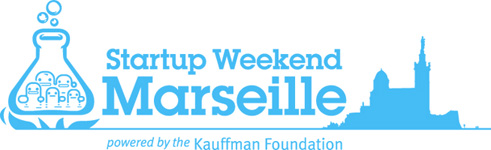
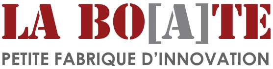
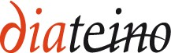
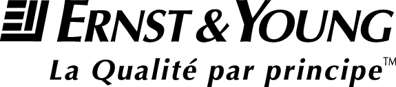
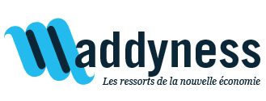
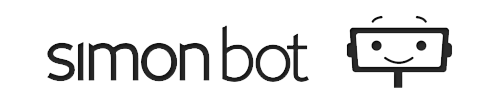
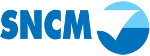

<!SLIDE bullets>

# Apéro SWMA 
* La Boate, Marseille, le 17 novembre 2012

<!SLIDE transition=scrollUp>

<!SLIDE transition=scrollUp>

# Le Startup Weekend
## Qu'est-ce que c'est ?

<!SLIDE bullets incremental transition=scrollUp>

* Un moyen pour tester une idée
* Et lui donner vie à en 54h

<!SLIDE transition=scrollUp>

# Mais aussi

<!SLIDE bullets incremental transition=scrollUp>

* Faire se rencontrer les entrepreneurs 
* Initier le partage de compétences
* Créer des entreprises

<!SLIDE transition=scrollUp>

# Et vous n'êtes pas seuls

<!SLIDE bullets incremental transition=scrollUp>

* Des speakers pour vous inspirer
* Des coachs pour vous conseiller
* De la visibilité

<!SLIDE bullets transition=scrollUp>

# Mais qui peut venir ?

<!SLIDE bullets incremental transition=scrollUp>

* Vous avez une idée mais pas les moyens techniques ? vous pouvez venir.
* Vous êtes un designer en mal d'aventures ? vous pouvez venir.
* Vous avez des compétences techniques et envie de tenter quelque chose de nouveau ? vous pouvez venir. 

<!SLIDE transition=scrollUp>

# Et en vrai sa donne quoi ? 

<!SLIDE bullets transition=scrollUp>

# [Jimmy Fairly](http://www.jimmyfairly.com/)

<!SLIDE bullets incremental transition=scrollUp>

* Gagnant du SW Toulouse #1 (2011)
* Lunettes design au prix unique de 95 €
* [Buy one Give one](http://www.jimmyfairly.com/fr/buy-one-give-one.html)

<!SLIDE bullets transition=scrollUp>

# [Very Last Room](http://verylastroom.com/fr)
## Anciènement Booking Brick

<!SLIDE bullets incremental transition=scrollUp>

* Gagnant du SW Marseille #1 (2010)
* Trouver une chambre d'hôtel à la dernière minute
* Au plus petit prix
* Application mobile 

<!SLIDE bullets transition=scrollUp>

# Les partenaires du SWMA

<!SLIDE bullets transition=scrollUp>

<!SLIDE bullets transition=scrollUp>

# De beaux cadeaux

<!SLIDE bullets transition=scrollUp>

* Des voyages [SNCM](http://www.sncm.fr/sw/consumer.index.do?locale=fr_FR&languageCode=FRA)
* Des journées de conseil [Ernst&Young](http://www.ey.com/FR/fr/Home/Article)
* 3 à 6 mois d'hébergement à la [Boate](http://laboate.com/)
* Des crédits [TextMaster](http://fr.textmaster.com/?gclid=CPCZ5_XflrMCFcVY3god4xQAfQ)
* Des crédits [Tuto.com](http://fr.tuto.com/)
* Des réductions aux éditions [Diateino](http://www.diateino.com/fr/)
* Espace de co-working et accompagnement par [Marseille Innovation](http://www.marseille-innov.org/)

<!SLIDE bullets transition=scrollUp>

# Les prochains rendez-vous

<!SLIDE bullets incremental transition=scrollUp>

* Le 27 novembre à 18h, 8ème Angels café, [au siège de la société Marseillaise de Crédit](https://maps.google.fr/maps?hl=fr&q=8+angels+caf%C3%A9+marseille&bav=on.2,or.r_gc.r_pw.r_cp.r_qf.&bpcl=38625945&biw=1268&bih=747&um=1&ie=UTF-8&sa=N&tab=wl&authuser=0)
* Le 29 novembre à [Marseille Innovation](http://www.marseille-innov.org/) pour  soirée de prélancement et une exposition
* Et le 30 novembre à Euromed Management pour...

<!SLIDE bullets transition=scrollUp>

<iframe width="560" height="315" src="http://www.youtube.com/embed/t-VjwfaRRqg" frameborder="0" allowfullscreen></iframe>

<!SLIDE bullets transition=scrollUp>

# Code promo ?
Voir pour mettre 10 codes promos @antoine

<!SLIDE bullets transition=scrollUp>

# Merci pour votre attention
* [marseille.startupweekend.org](http://marseille.startupweekend.org)